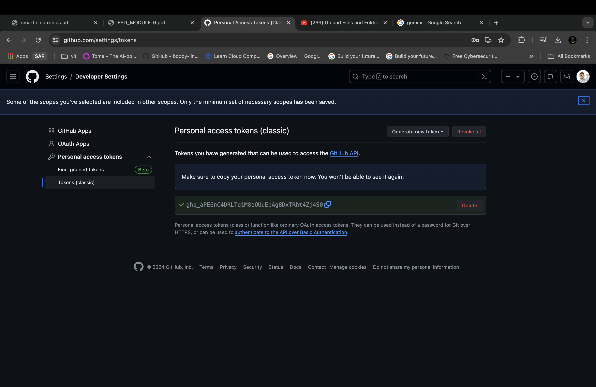

# HealthBot — AI Medical Assistant

HealthBot is an AI-powered medical assistant that provides instant, reliable, and accurate health information.  
It leverages **state-of-the-art NLP** and deep learning to help users check symptoms, get medical advice, and access general healthcare knowledge.  

🌐 Try the live demo here: [HealthBot - AI Medical Assistant](https://healthbot---ai-medical-assistant.streamlit.app/)

---

## 🏥 Overview

Healthcare access can be challenging and time-consuming. HealthBot addresses this problem by providing:

- **Symptom Checker**: Input your symptoms to receive potential causes and recommended actions.
- **Medical Advice**: Get guidance and information on general health topics and conditions.
- **AI-Powered NLP**: Understands natural language queries for accurate responses.
- **Interactive Interface**: Easy-to-use GUI for seamless user experience.
- **Notebook-Based Training**: Transparent model development with modifiable code for experimentation.

---

## 🚀 Features

- **Conversational AI Assistant**: Understands and responds to health queries in natural language.
- **Symptom Analysis**: Helps identify potential causes based on user input.
- **Interactive Web Interface**: Built with a user-friendly frontend for quick interactions.
- **Customizable Model**: Train or fine-tune the model on your own medical dataset.
- **Visual Output**: Provides clear, informative responses with structured outputs.

---

## 🖥️ Output Example

### Chat Interface

---

## 🧰 Installation

1. Clone the repository:

       git clone https://github.com/tusharsachan15/HealthBot---AI-Medical-Assistant.git
       cd HealthBot---AI-Medical-Assistant

2. Install the required Python packages:

       pip install -r requirements.txt

## 🤝 Contribution Guidelines

Contributions to the project are encouraged! Whether you're interested in improving detection accuracy, adding support for new crops, or refining the web interface — your input is welcome.

To contribute:

1. Fork this repository  
2. Create a new feature branch  
3. Make your changes and test thoroughly  
4. Submit a pull request

If you're unsure where to start, feel free to open an issue or discussion first.

---

## 📬 Contact

For any questions, suggestions, or collaboration opportunities, feel free to reach out:

- **Email**: [tusharsachan2002@gmail.com](mailto:tusharsachan2002@gmail.com)
